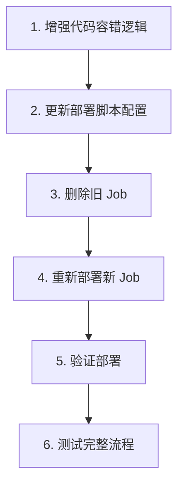

# FcstLabPro 修复实施计划 - 方案 C

**方案**: 重新部署整个 Job，使用正确名称 + 增强代码容错  
**目标**: 确保明天早上 8 点能收到完整的邮件通知

---

## 📋 实施步骤概览



---

## 🔧 步骤 1: 增强代码容错逻辑

### 1.1 修改 `scripts/weekly_signal.py`

**文件**: [`scripts/weekly_signal.py`](scripts/weekly_signal.py:51)  
**修改位置**: `load_model_and_features()` 函数

**修改内容**:
```python
def load_model_and_features(exp_dir: str):
    """加载模型、特征配置和元信息（增强容错）."""
    import yaml, json
    exp_path = PROJECT_ROOT / exp_dir
    model = joblib.load(exp_path / "model.joblib")
    
    with open(exp_path / "config.yaml") as f:
        config = yaml.safe_load(f)
    
    # 加载 meta.json 或 metrics.json
    meta = {}
    for meta_file in ["metrics.json", "meta.json"]:
        meta_path = exp_path / meta_file
        if meta_path.exists():
            with open(meta_path) as mf:
                meta = json.load(mf)
            break
    
    # 🔧 增强：从 config 补充缺失字段
    exp_config = config.get("experiment", {})
    
    # 补充 version
    if "version" not in meta:
        meta["version"] = exp_config.get("name", meta.get("name", "unknown"))
    
    # 补充 label_strategy
    if "label_strategy" not in meta:
        label_cfg = config.get("label", {})
        meta["label_strategy"] = label_cfg.get("strategy", "unknown")
    
    # 补充 feature_set
    if "feature_set" not in meta:
        feat_cfg = config.get("features", {})
        meta["feature_set"] = feat_cfg.get("sets", [])
    
    # 补充 kappa
    if "kappa" not in meta:
        kappa = None
        if "aggregate_metrics" in meta and "cohen_kappa" in meta["aggregate_metrics"]:
            kappa = meta["aggregate_metrics"]["cohen_kappa"]
            # 格式化为 2 位小数
            if kappa is not None:
                kappa = f"{kappa:.2f}"
        meta["kappa"] = kappa if kappa is not None else "N/A"
    
    logger.info(f"[DEBUG] loaded meta for {exp_dir}: version={meta.get('version')}, kappa={meta.get('kappa')}, label_strategy={meta.get('label_strategy')}")
    
    return model, config, meta
```

**修改原因**:
- 从 `config.yaml` 自动提取缺失的元信息
- 兼容所有模型（v8b、消融实验、未来新模型）
- 提供合理的默认值，避免显示 N/A

---

## 🚀 步骤 2: 更新部署脚本配置

### 2.1 修改 `deploy/gcloud_deploy.sh`

**文件**: [`deploy/gcloud_deploy.sh`](deploy/gcloud_deploy.sh:125)

**修改 1: 添加 SMTP 环境变量支持**

在脚本开头添加 SMTP 配置变量（第 18 行后）:
```bash
# SMTP 邮件配置（从环境变量读取）
SMTP_USER="${SMTP_USER:-}"
SMTP_PASS="${SMTP_PASS:-}"
MAIL_TO="${MAIL_TO:-}"
```

**修改 2: 更新环境变量构建逻辑**

修改第 125-133 行:
```bash
# 构建环境变量
ENV_VARS="BULL_DIR=${BULL_DIR:-experiments/weekly/weekly_bull_v8b_20260213_235350_e97aaf}"
ENV_VARS="${ENV_VARS},BEAR_DIR=${BEAR_DIR:-experiments/weekly/weekly_bear_v8b_20260214_000003_545cf4}"
ENV_VARS="${ENV_VARS},OUT_DIR=/tmp/signals"

# 添加 SMTP 配置
if [ -n "${SMTP_USER}" ]; then
    ENV_VARS="${ENV_VARS},SMTP_USER=${SMTP_USER}"
fi
if [ -n "${SMTP_PASS}" ]; then
    ENV_VARS="${ENV_VARS},SMTP_PASS=${SMTP_PASS}"
fi
if [ -n "${MAIL_TO}" ]; then
    ENV_VARS="${ENV_VARS},MAIL_TO=${MAIL_TO}"
fi

# 可选配置
if [ -n "${OUT_BUCKET}" ]; then
    ENV_VARS="${ENV_VARS},OUT_BUCKET=${OUT_BUCKET}"
fi
if [ -n "${NOTIFICATION_URL}" ]; then
    ENV_VARS="${ENV_VARS},NOTIFICATION_URL=${NOTIFICATION_URL}"
fi
```

**修改 3: 添加部署前检查**

在 Step 4 之前添加（第 120 行后）:
```bash
# ─────────────────────────────────────────────────────────────
# Step 3.5: 部署前检查
# ─────────────────────────────────────────────────────────────
echo ""
echo "=== Step 3.5: 部署前检查 ==="

# 检查 SMTP 配置
if [ -z "${SMTP_USER}" ] || [ -z "${SMTP_PASS}" ] || [ -z "${MAIL_TO}" ]; then
    echo "⚠️  警告: SMTP 配置不完整，邮件发送功能将被禁用"
    echo "   请设置环境变量: SMTP_USER, SMTP_PASS, MAIL_TO"
    read -p "   是否继续部署? (y/N) " -n 1 -r
    echo
    if [[ ! $REPLY =~ ^[Yy]$ ]]; then
        echo "❌ 部署已取消"
        exit 1
    fi
else
    echo "✅ SMTP 配置已设置"
fi

# 检查模型目录是否存在
BULL_DIR_CHECK="${BULL_DIR:-experiments/weekly/weekly_bull_v8b_20260213_235350_e97aaf}"
BEAR_DIR_CHECK="${BEAR_DIR:-experiments/weekly/weekly_bear_v8b_20260214_000003_545cf4}"

if [ ! -d "${BULL_DIR_CHECK}" ]; then
    echo "❌ Bull 模型目录不存在: ${BULL_DIR_CHECK}"
    exit 1
fi
if [ ! -d "${BEAR_DIR_CHECK}" ]; then
    echo "❌ Bear 模型目录不存在: ${BEAR_DIR_CHECK}"
    exit 1
fi
echo "✅ 模型目录检查通过"
```

---

## 🗑️ 步骤 3: 删除旧 Job

### 3.1 删除现有的 Job

```bash
# 删除旧 Job
gcloud run jobs delete daily-btc-signal-a6a8 \
    --region=asia-east1 \
    --quiet

# 确认删除
gcloud run jobs list --region=asia-east1 | grep daily-btc-signal
```

### 3.2 检查 Scheduler 状态

```bash
# 查看现有 Scheduler
gcloud scheduler jobs describe daily-btc-signal-trigger \
    --location=asia-east1

# 如果存在，暂停它（避免部署期间触发）
gcloud scheduler jobs pause daily-btc-signal-trigger \
    --location=asia-east1
```

---

## 🚢 步骤 4: 重新部署新 Job

### 4.1 设置环境变量

```bash
# 导出必要的环境变量
export GCP_PROJECT_ID="forecastlab-prod"
export SMTP_USER="792680027@qq.com"
export SMTP_PASS="mlefgnksjkafbfei"
export MAIL_TO="792680027@qq.com"

# 可选：指定模型目录（默认使用 v8b）
# export BULL_DIR="experiments/weekly/weekly_bull_ablation_triple_barrier_20260214_001719_ee6ac2"
# export BEAR_DIR="experiments/weekly/ablation_bear_A8_v4style_T14_20260214_002053_92a350"
```

### 4.2 执行部署脚本

```bash
# 确保在项目根目录
cd /Users/qiubling/Desktop/projects/FcstLabPro

# 执行部署
./deploy/gcloud_deploy.sh
```

**预期输出**:
- ✅ API 已启用
- ✅ Artifact Registry 仓库就绪
- ✅ 镜像构建并推送成功
- ✅ SMTP 配置检查通过
- ✅ 模型目录检查通过
- ✅ Cloud Run Job 创建成功
- ✅ 测试执行完成
- ✅ Cloud Scheduler 创建/更新成功

---

## ✅ 步骤 5: 验证部署

### 5.1 检查 Job 配置

```bash
# 查看 Job 详情
gcloud run jobs describe daily-btc-signal-v6 \
    --region=asia-east1 \
    --format=yaml > /tmp/job_config.yaml

# 检查环境变量是否正确
grep -A 20 "env:" /tmp/job_config.yaml
```

**预期结果**:
```yaml
env:
- name: BULL_DIR
  value: experiments/weekly/weekly_bull_v8b_20260213_235350_e97aaf
- name: BEAR_DIR
  value: experiments/weekly/weekly_bear_v8b_20260214_000003_545cf4
- name: SMTP_USER
  value: 792680027@qq.com
- name: SMTP_PASS
  value: mlefgnksjkafbfei
- name: MAIL_TO
  value: 792680027@qq.com
```

### 5.2 检查 Scheduler 配置

```bash
# 查看 Scheduler 详情
gcloud scheduler jobs describe daily-btc-signal-trigger \
    --location=asia-east1

# 恢复 Scheduler（如果之前暂停了）
gcloud scheduler jobs resume daily-btc-signal-trigger \
    --location=asia-east1
```

**预期结果**:
- Schedule: `0 8 * * *`
- Time Zone: `Asia/Shanghai`
- Target URI: 包含 `daily-btc-signal-v6`
- State: `ENABLED`

---

## 🧪 步骤 6: 测试完整流程

### 6.1 手动触发 Job

```bash
# 手动执行 Job
gcloud run jobs execute daily-btc-signal-v6 \
    --region=asia-east1 \
    --wait
```

### 6.2 查看执行日志

```bash
# 查看最近的日志
gcloud logging read \
    'resource.type="cloud_run_job" AND resource.labels.job_name="daily-btc-signal-v6"' \
    --limit=100 \
    --format=json > /tmp/job_logs.json

# 或使用简化命令
gcloud logging read \
    'resource.type="cloud_run_job" AND resource.labels.job_name="daily-btc-signal-v6"' \
    --limit=50
```

### 6.3 验证邮件内容

**检查项**:
- ✅ 邮件主题包含日期和信号
- ✅ 模型版本显示正确（不是 N/A）
- ✅ Kappa 值显示正确（不是 N/A）
- ✅ 标签策略显示正确（不是 N/A）
- ✅ 特征集显示正确（不是空）
- ✅ Bull/Bear 概率正常
- ✅ 仓位建议合理

### 6.4 测试 Scheduler 触发

```bash
# 手动触发 Scheduler（不等待明天）
gcloud scheduler jobs run daily-btc-signal-trigger \
    --location=asia-east1

# 等待 1-2 分钟后查看执行记录
gcloud run jobs executions list \
    --job=daily-btc-signal-v6 \
    --region=asia-east1 \
    --limit=5
```

---

## 📊 验收标准

### 必须满足的条件

- [x] Job 名称为 `daily-btc-signal-v6`
- [x] Scheduler 触发 URI 指向 `daily-btc-signal-v6`
- [x] 环境变量包含 SMTP 配置
- [x] 手动执行 Job 成功
- [x] 收到邮件通知
- [x] 邮件内容无 N/A（模型版本、Kappa、标签策略、特征集）
- [x] Scheduler 状态为 ENABLED
- [x] 调度时间为每天 08:00 (Asia/Shanghai)

### 可选验证

- [ ] 查看 Cloud Run Job 执行历史
- [ ] 查看 Cloud Scheduler 执行历史
- [ ] 设置告警通知（执行失败时）

---

## 🔄 回滚方案

如果部署失败或出现问题：

### 方案 A: 快速回滚到旧 Job

```bash
# 1. 暂停新 Scheduler
gcloud scheduler jobs pause daily-btc-signal-trigger --location=asia-east1

# 2. 更新 Scheduler 指向旧 Job
gcloud scheduler jobs update http daily-btc-signal-trigger \
    --location=asia-east1 \
    --uri="https://asia-east1-run.googleapis.com/apis/run.googleapis.com/v1/namespaces/955286039748/jobs/daily-btc-signal-a6a8:run"

# 3. 恢复 Scheduler
gcloud scheduler jobs resume daily-btc-signal-trigger --location=asia-east1
```

### 方案 B: 手动执行旧 Job

```bash
# 如果旧 Job 还存在
gcloud run jobs execute daily-btc-signal-a6a8 \
    --region=asia-east1 \
    --wait
```

---

## 📝 部署检查清单

### 部署前
- [ ] 代码修改已完成（`weekly_signal.py`）
- [ ] 部署脚本已更新（`gcloud_deploy.sh`）
- [ ] 环境变量已设置（SMTP_USER, SMTP_PASS, MAIL_TO）
- [ ] 模型目录存在且包含 `model.joblib`
- [ ] 已备份当前 Job 配置（`job.yaml`）

### 部署中
- [ ] 旧 Job 已删除
- [ ] Scheduler 已暂停（可选）
- [ ] 镜像构建成功
- [ ] Job 创建成功
- [ ] 测试执行成功

### 部署后
- [ ] Job 配置正确
- [ ] Scheduler 配置正确
- [ ] 手动触发测试通过
- [ ] 邮件内容正确
- [ ] Scheduler 已恢复/启用
- [ ] 日志无错误

---

## 🎯 预期结果

### 明天早上 8:00
- ✅ Cloud Scheduler 自动触发 `daily-btc-signal-v6`
- ✅ Job 成功执行，下载最新数据
- ✅ 生成交易信号（Bull/Bear 概率）
- ✅ 发送邮件到 `792680027@qq.com`
- ✅ 邮件内容完整，无 N/A

### 邮件示例
```
主题: [BTC信号] 2026-02-15 📈 强多头 — FcstLabPro Bull=weekly_bull_v8b, Bear=weekly_bear_v8b

模型版本：Bull=weekly_bull_v8b, Bear=weekly_bear_v8b
Kappa：Bull=-0.03, Bear=N/A
标签策略：Bull=reversal, Bear=reversal
特征集：Bull=technical, volume, flow, sentiment，Bear=technical, volume, flow, sentiment

当前价格: $69,567.67
🐂 大涨概率: 11.4%
🐻 大跌概率: 7.8%
建议仓位: 50%
```

---

## 📞 故障排查

### 问题 1: 镜像构建失败
```bash
# 检查 Dockerfile 语法
docker build -t test .

# 查看构建日志
gcloud builds list --limit=5
```

### 问题 2: Job 执行失败
```bash
# 查看详细日志
gcloud logging read \
    'resource.type="cloud_run_job" AND severity>=ERROR' \
    --limit=50

# 检查环境变量
gcloud run jobs describe daily-btc-signal-v6 \
    --region=asia-east1 \
    --format="value(spec.template.spec.template.spec.containers[0].env)"
```

### 问题 3: 邮件未发送
```bash
# 检查 SMTP 配置
echo $SMTP_USER
echo $MAIL_TO

# 查看邮件发送日志
gcloud logging read \
    'resource.type="cloud_run_job" AND textPayload=~"邮件"' \
    --limit=20
```

### 问题 4: Scheduler 未触发
```bash
# 检查 Scheduler 状态
gcloud scheduler jobs describe daily-btc-signal-trigger \
    --location=asia-east1

# 查看 Scheduler 执行历史
gcloud scheduler jobs executions list \
    --job=daily-btc-signal-trigger \
    --location=asia-east1
```

---

## 🚀 执行命令汇总

```bash
# === 准备阶段 ===
cd /Users/qiubling/Desktop/projects/FcstLabPro
export GCP_PROJECT_ID="forecastlab-prod"
export SMTP_USER="792680027@qq.com"
export SMTP_PASS="mlefgnksjkafbfei"
export MAIL_TO="792680027@qq.com"

# === 删除旧 Job ===
gcloud run jobs delete daily-btc-signal-a6a8 --region=asia-east1 --quiet

# === 暂停 Scheduler（可选）===
gcloud scheduler jobs pause daily-btc-signal-trigger --location=asia-east1

# === 部署新 Job ===
./deploy/gcloud_deploy.sh

# === 验证部署 ===
gcloud run jobs describe daily-btc-signal-v6 --region=asia-east1
gcloud scheduler jobs describe daily-btc-signal-trigger --location=asia-east1

# === 测试执行 ===
gcloud run jobs execute daily-btc-signal-v6 --region=asia-east1 --wait

# === 恢复 Scheduler ===
gcloud scheduler jobs resume daily-btc-signal-trigger --location=asia-east1

# === 查看日志 ===
gcloud logging read 'resource.type="cloud_run_job" AND resource.labels.job_name="daily-btc-signal-v6"' --limit=50
```
